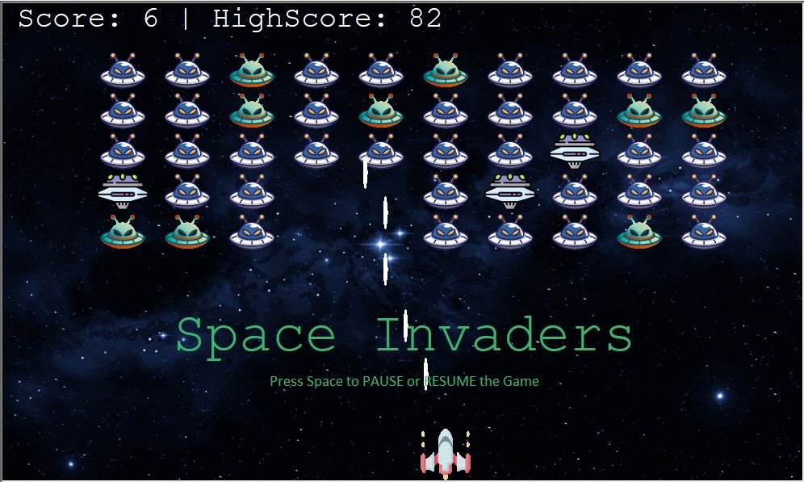

# Space Invaders Clone: Python Turtle Game

Welcome to the Space Invaders Clone repository, where you'll find an exciting Python game developed using the Turtle library. This repository houses a faithful recreation of the classic Space Invaders game, offering an immersive gaming experience. Whether you're a beginner or an experienced Python developer, this project provides an opportunity to dive into game development and explore the capabilities of the Turtle library. Join us on this adventure as we bring the nostalgic Space Invaders game to life using the power of Python and the intuitive Turtle graphics library. Get ready to defend the Earth against a relentless alien invasion!

 

<b>
  <a href='https://ishanrastogi26.wordpress.com/2023/07/13/step-by-step-guide-building-a-space-invaders-game-clone-in-python/'>
    Click to View a Step-by-Step Guide to Building this Project.
  </a>
</b>
